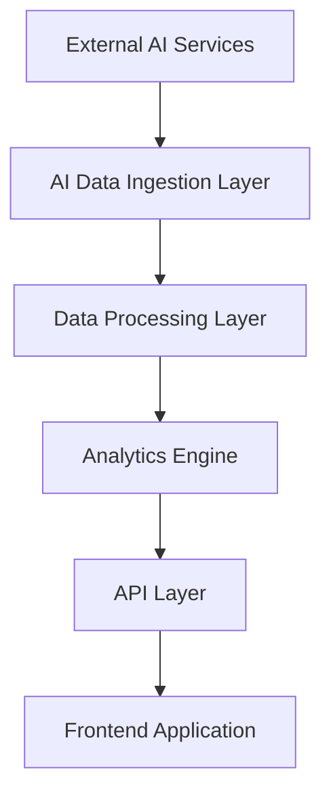

# Contently LLM Analytics - Technical Design Document (TDD)

## 1. System Architecture

### 1.1 High-Level Architecture


### 1.2 Component Overview

#### Data Ingestion Layer
- **AI Platform Connectors**
  - ChatGPT API Integration
  - Perplexity API Integration
  - GitHub Copilot Integration
  - Google AI Reviews Integration
- **Web Crawlers**
  - AI Bot Detection
  - Content Indexing
  - Real-time Monitoring

#### Data Processing Layer
- **Stream Processing**
  - Apache Kafka for real-time data streams
  - Event-driven architecture
- **Batch Processing**
  - Daily aggregations
  - Historical analysis
  - Trend computation

#### Analytics Engine
- **Natural Language Processing**
  - Sentiment Analysis
  - Entity Recognition
  - Topic Modeling
- **Metrics Computation**
  - Share of Voice Calculator
  - Visibility Score Engine
  - Competitive Analysis

#### API Layer
- **RESTful APIs**
  - GraphQL endpoints
  - WebSocket for real-time updates
- **Authentication & Authorization**
  - OAuth 2.0
  - JWT tokens
  - Role-based access control

#### Frontend Application
- **React-based SPA**
  - TypeScript implementation
  - Material UI components
  - Real-time data visualization

## 2. Technical Requirements

### 2.1 Performance Requirements
- Response time < 200ms for API calls
- Dashboard loading time < 2s
- Support for 1000+ concurrent users
- Handle 100M+ daily events
- 99.9% uptime SLA

### 2.2 Security Requirements
- SOC 2 Type I compliance
- Data encryption at rest (AES-256)
- TLS 1.3 for data in transit
- RBAC implementation
- SSO integration
- Regular security audits

### 2.3 Scalability Requirements
- Horizontal scaling capability
- Auto-scaling based on load
- Multi-region deployment
- Load balancing
- Cache optimization

### 2.4 Data Requirements
- Real-time data processing
- Data retention policies
- Backup and recovery
- Data versioning
- GDPR/CCPA compliance

## 3. Technical Implementation

### 3.1 Data Storage
```typescript
// Example Schema Definitions

interface BrandMention {
  id: string;
  brandId: string;
  platform: AIPlatform;
  content: string;
  sentiment: SentimentScore;
  timestamp: Date;
  context: {
    query: string;
    response: string;
    citations: Citation[];
  };
}

interface VisibilityScore {
  brandId: string;
  score: number;
  components: {
    mentions: number;
    sentiment: number;
    authority: number;
  };
  period: {
    start: Date;
    end: Date;
  };
}
```

### 3.2 API Endpoints
```typescript
// Core API Routes

interface APIRoutes {
  '/api/v1/brands': {
    GET: () => Brand[];
    POST: (brand: Brand) => Brand;
  };
  
  '/api/v1/analytics': {
    GET: (params: AnalyticsParams) => AnalyticsResult;
  };
  
  '/api/v1/mentions': {
    GET: (params: MentionParams) => PaginatedMentions;
    STREAM: () => WebSocket;
  };
}
```

### 3.3 Event Processing
```typescript
// Event Processing Pipeline

interface EventProcessor {
  process(event: AIEvent): Promise<ProcessedEvent>;
  enrich(event: ProcessedEvent): Promise<EnrichedEvent>;
  analyze(event: EnrichedEvent): Promise<AnalyzedEvent>;
  store(event: AnalyzedEvent): Promise<void>;
}
```

## 4. Infrastructure

### 4.1 AWS Architecture
- ECS for containerized services
- Aurora PostgreSQL for relational data
- ElastiCache for caching
- S3 for object storage
- CloudFront for CDN
- Route53 for DNS
- CloudWatch for monitoring

### 4.2 Monitoring & Alerting
- Prometheus metrics
- Grafana dashboards
- PagerDuty integration
- Log aggregation
- Performance monitoring
- Error tracking

### 4.3 CI/CD Pipeline
- GitHub Actions
- Docker containers
- Infrastructure as Code
- Automated testing
- Blue-green deployments
- Rollback capabilities

## 5. Development Guidelines

### 5.1 Code Standards
- TypeScript for type safety
- ESLint configuration
- Prettier formatting
- Jest for testing
- 90% test coverage requirement
- Code review process

### 5.2 Documentation
- OpenAPI/Swagger
- JSDoc comments
- Architecture diagrams
- API documentation
- Deployment guides
- Runbooks

## 6. Testing Strategy

### 6.1 Test Types
- Unit tests
- Integration tests
- E2E tests
- Performance tests
- Security tests
- Load tests

### 6.2 Test Implementation
```typescript
// Example Test Structure

describe('VisibilityScoreCalculator', () => {
  let calculator: VisibilityScoreCalculator;
  
  beforeEach(() => {
    calculator = new VisibilityScoreCalculator();
  });
  
  test('calculates correct score', async () => {
    const result = await calculator.calculate({
      mentions: 100,
      sentiment: 0.8,
      authority: 0.9
    });
    
    expect(result.score).toBeCloseTo(0.85);
  });
});
```

## 7. Deployment Strategy

### 7.1 Environments
- Development
- Staging
- Production
- DR site

### 7.2 Release Process
- Feature branches
- PR reviews
- Automated tests
- Staging validation
- Production deployment
- Monitoring period

## 8. Security Measures

### 8.1 Authentication
- OAuth 2.0 implementation
- JWT token management
- SSO integration
- MFA requirement
- Session management

### 8.2 Authorization
- RBAC implementation
- Permission matrices
- API gateway security
- Rate limiting
- Input validation

## 9. Compliance

### 9.1 Data Privacy
- GDPR compliance
- CCPA compliance
- Data retention
- Data encryption
- Access logging

### 9.2 Audit Trail
- User activity logs
- System changes
- Data access logs
- Security events
- Compliance reports 