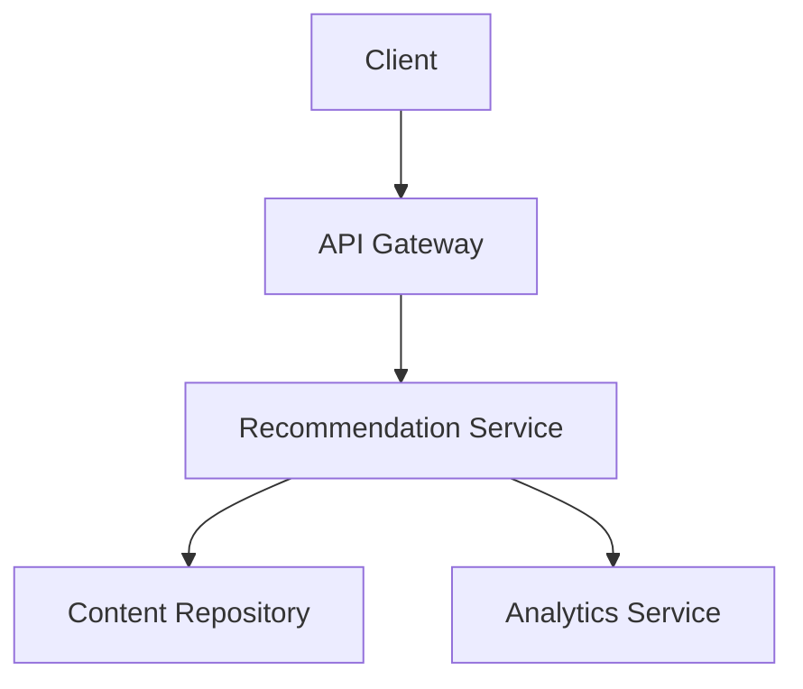
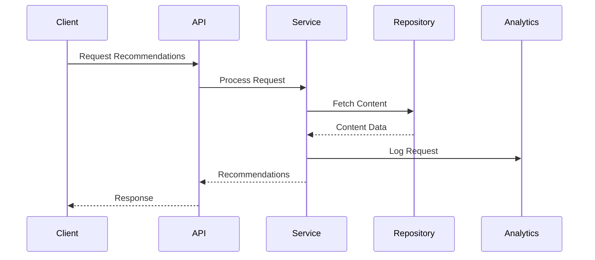

# Documentation Guidelines

## Core Documentation Principles

1. **Comprehensive Coverage**
   - Document all public APIs
   - Include usage examples
   - Explain complex logic
   - Keep documentation up-to-date

2. **AI-Friendly Documentation**
   - Clear and concise descriptions
   - Consistent formatting
   - Proper code examples
   - Searchable content

## Code Documentation

### 1. TypeScript Interfaces and Types
```typescript
/**
 * Represents a content recommendation from the AI engine
 * @interface ContentRecommendation
 */
interface ContentRecommendation {
  /** Unique identifier for the recommendation */
  id: string;
  
  /** Type of content being recommended */
  type: ContentType;
  
  /** Confidence score (0-1) for this recommendation */
  confidence: number;
  
  /** Metadata associated with the recommendation */
  metadata: RecommendationMetadata;
  
  /** Timestamp when recommendation was generated */
  generatedAt: Date;
}

/**
 * Types of content that can be recommended
 * @enum {string}
 */
type ContentType = 'article' | 'video' | 'infographic' | 'podcast';
```

### 2. Class Documentation
```typescript
/**
 * Service responsible for generating and managing content recommendations
 * @class RecommendationService
 * @implements {RecommendationEngine}
 */
@Injectable()
export class RecommendationService implements RecommendationEngine {
  /**
   * Creates an instance of RecommendationService
   * @param {ContentRepository} contentRepo - Repository for content management
   * @param {AnalyticsService} analytics - Service for tracking recommendations
   */
  constructor(
    private readonly contentRepo: ContentRepository,
    private readonly analytics: AnalyticsService
  ) {}

  /**
   * Generates content recommendations based on user preferences
   * @param {UserPreferences} preferences - User's content preferences
   * @returns {Promise<ContentRecommendation[]>} Array of recommendations
   * @throws {RecommendationError} When recommendation generation fails
   */
  async generateRecommendations(
    preferences: UserPreferences
  ): Promise<ContentRecommendation[]> {
    // Implementation
  }
}
```

### 3. Function Documentation
```typescript
/**
 * Analyzes content sentiment and extracts key topics
 * @param {string} content - The content to analyze
 * @param {AnalysisOptions} [options] - Optional analysis configuration
 * @returns {Promise<ContentAnalysis>} Analysis results
 * @throws {ValidationError} When content is invalid
 * @example
 * const analysis = await analyzeContent(
 *   "AI is transforming content creation",
 *   { language: 'en', maxTopics: 5 }
 * );
 */
async function analyzeContent(
  content: string,
  options?: AnalysisOptions
): Promise<ContentAnalysis> {
  // Implementation
}
```

## API Documentation

### 1. REST API Documentation
```typescript
/**
 * @swagger
 * /api/recommendations:
 *   post:
 *     summary: Generate content recommendations
 *     description: |
 *       Generates personalized content recommendations based on
 *       user preferences and historical interactions.
 *     tags:
 *       - Recommendations
 *     requestBody:
 *       required: true
 *       content:
 *         application/json:
 *           schema:
 *             $ref: '#/components/schemas/RecommendationRequest'
 *     responses:
 *       200:
 *         description: Successful recommendation generation
 *         content:
 *           application/json:
 *             schema:
 *               $ref: '#/components/schemas/RecommendationResponse'
 *       400:
 *         description: Invalid request parameters
 *       401:
 *         description: Unauthorized request
 */
@Post()
async generateRecommendations(
  @Body() request: RecommendationRequest
): Promise<RecommendationResponse> {
  // Implementation
}
```

### 2. GraphQL Documentation
```typescript
/**
 * @graphql
 * type Recommendation {
 *   """
 *   Unique identifier for the recommendation
 *   """
 *   id: ID!
 *
 *   """
 *   Type of content being recommended
 *   """
 *   type: ContentType!
 *
 *   """
 *   Confidence score (0-1) for this recommendation
 *   """
 *   confidence: Float!
 * }
 *
 * input RecommendationInput {
 *   """
 *   User preferences for content recommendations
 *   """
 *   preferences: UserPreferencesInput!
 * }
 */
@ObjectType()
export class Recommendation {
  @Field(() => ID)
  id: string;

  @Field(() => ContentType)
  type: ContentType;

  @Field(() => Float)
  confidence: number;
}
```

## README Documentation

### 1. Project README Template
```markdown
# Feature Name

## Overview
Brief description of the feature and its purpose.

## Setup
```bash
# Installation steps
npm install
npm run setup
```

## Configuration
```typescript
// Configuration example
const config = {
  apiKey: process.env.API_KEY,
  maxRetries: 3
};
```

## Usage
```typescript
// Usage example
const result = await feature.process(input);
```

## API Reference
- Endpoint: `/api/feature`
- Method: `POST`
- Request/Response examples

## Troubleshooting
Common issues and solutions.
```

### 2. Module Documentation
```markdown
# Module: Content Recommendations

## Purpose
Explains the module's responsibility and role.

## Components
- RecommendationService
- ContentAnalyzer
- UserPreferenceManager

## Dependencies
- External APIs
- Required services
- Configuration

## Usage Examples
Code examples for common use cases.
```

## Architecture Documentation

### 1. Component Diagrams


### 2. Sequence Diagrams


## Maintenance Documentation

### 1. Deployment Guide
```markdown
# Deployment Process

## Prerequisites
- Required credentials
- Environment setup
- Dependencies

## Steps
1. Build process
2. Deployment commands
3. Verification steps
4. Rollback procedure

## Monitoring
- Health checks
- Metrics
- Logging
```

### 2. Troubleshooting Guide
```markdown
# Troubleshooting

## Common Issues
1. Issue: Service not responding
   Solution: Check service health and logs

2. Issue: High latency
   Solution: Review database queries and caching

## Debugging
- Log locations
- Debug commands
- Monitoring tools

## Support
- Contact information
- Escalation process
```

## Version Control Documentation

### 1. Commit Messages
```
feat(recommendations): implement content type analysis

- Add content type detection
- Integrate with ML service
- Update unit tests

Breaking Changes:
- Changed recommendation API response format
```

### 2. Pull Request Template
```markdown
## Description
Brief description of changes

## Type of Change
- [ ] Bug fix
- [ ] New feature
- [ ] Breaking change
- [ ] Documentation update

## Testing
- [ ] Unit tests
- [ ] Integration tests
- [ ] Manual testing

## Documentation
- [ ] README updated
- [ ] API docs updated
- [ ] Breaking changes documented
``` 